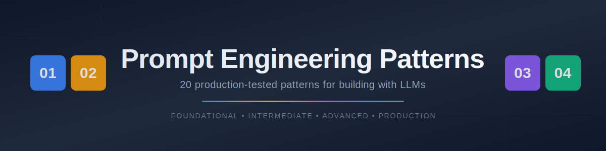
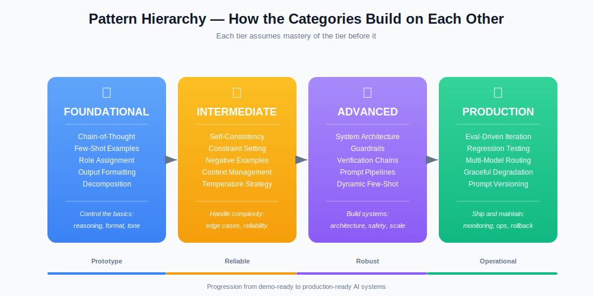

<div align="center">



<br/>


**A practitioner's reference for building reliable, production-grade AI systems with LLMs.**

*Every pattern shows what breaks, what fixes it, and why.*

</div>

---

## 🎯 Why This Exists

Most prompt engineering guides are either academic (useless) or a list of tricks (forgettable). This repo is different: it's **20 patterns I've used in production**, each documented with a real failure, a real fix, and the mechanics behind why the fix works.

If you're evaluating AI engineers or building AI products, this repo answers the question: *"Does this person actually understand how LLMs work, or are they just vibing with ChatGPT?"*

---

## 📚 Table of Contents

<table>
<tr>
<td width="50%" valign="top">

### 🧱 Foundational
*Control the basics: reasoning, format, tone*

| # | Pattern | Description |
|---|---------|-------------|
| 🔗 | [Chain-of-Thought](patterns/foundational/01-chain-of-thought.md) | Force reasoning before conclusions |
| 🎯 | [Few-Shot Examples](patterns/foundational/02-few-shot-examples.md) | Set quality bar with 2-3 examples |
| 🎭 | [Role Assignment](patterns/foundational/03-role-assignment.md) | Activate domain expertise with a persona |
| 📋 | [Output Formatting](patterns/foundational/04-output-formatting.md) | Lock structure for parseable outputs |
| 🪜 | [Step-by-Step Decomposition](patterns/foundational/05-step-by-step-decomposition.md) | Break complex tasks into subtasks |

</td>
<td width="50%" valign="top">

### ⚡ Intermediate
*Handle complexity: edge cases, reliability*

| # | Pattern | Description |
|---|---------|-------------|
| 🔄 | [Self-Consistency Checking](patterns/intermediate/06-self-consistency-checking.md) | Multi-framework analysis with synthesis |
| 🚧 | [Constraint Setting](patterns/intermediate/07-constraint-setting.md) | Guardrails on length, scope, and tone |
| 🚫 | [Negative Examples](patterns/intermediate/08-negative-examples.md) | Show what NOT to do, with annotations |
| 📐 | [Context Window Management](patterns/intermediate/09-context-window-management.md) | Fight the "lost in the middle" problem |
| 🌡️ | [Temperature & Sampling](patterns/intermediate/10-temperature-and-sampling-strategy.md) | Match randomness to task type |

</td>
</tr>
<tr>
<td width="50%" valign="top">

### 🔬 Advanced
*Build systems: architecture, safety, scale*

| # | Pattern | Description |
|---|---------|-------------|
| 🏗️ | [System Prompt Architecture](patterns/advanced/11-system-prompt-architecture.md) | Multi-section system prompts that hold up |
| 🛡️ | [Adversarial Guardrails](patterns/advanced/12-adversarial-guardrails.md) | Defense-in-depth against prompt injection |
| ✅ | [Chain of Verification](patterns/advanced/13-chain-of-verification.md) | Self-checking for factual accuracy |
| ⛓️ | [Prompt Chaining Pipelines](patterns/advanced/14-prompt-chaining-pipelines.md) | Multi-stage pipelines with code logic |
| 🎲 | [Dynamic Few-Shot Selection](patterns/advanced/15-dynamic-few-shot-selection.md) | Programmatic example retrieval |

</td>
<td width="50%" valign="top">

### 🏭 Production
*Ship and maintain: monitoring, ops, rollback*

| # | Pattern | Description |
|---|---------|-------------|
| 📊 | [Evaluation-Driven Iteration](patterns/production/16-evaluation-driven-iteration.md) | Replace gut-feel with systematic scoring |
| 🧪 | [Regression Testing](patterns/production/17-regression-testing-prompts.md) | CI/CD for prompts |
| 🔀 | [Multi-Model Routing](patterns/production/18-multi-model-routing.md) | Right model for the right task |
| 🔄 | [Graceful Degradation](patterns/production/19-graceful-degradation.md) | Fallback hierarchy when AI fails |
| 📦 | [Prompt Versioning](patterns/production/20-prompt-versioning.md) | Track, compare, roll back like code |

</td>
</tr>
</table>

---

## 🚀 Quick Start

> [!TIP]
> **Short on time? Start with these three patterns.** They're the highest-leverage for most real-world problems:
>
> 1. **[🏗️ System Prompt Architecture (#11)](patterns/advanced/11-system-prompt-architecture.md)** — The difference between a demo and a product.
> 2. **[📊 Evaluation-Driven Iteration (#16)](patterns/production/16-evaluation-driven-iteration.md)** — Stop tuning prompts by feel.
> 3. **[🛡️ Adversarial Guardrails (#12)](patterns/advanced/12-adversarial-guardrails.md)** — What separates "shipping" from "shipping safely."

For a scannable one-pager, see **[CHEATSHEET.md](CHEATSHEET.md)**.
For full end-to-end system designs, see **[USE-CASES.md](USE-CASES.md)**.

---

## 🔬 Before / After: What Good Prompt Engineering Looks Like

Every pattern in this repo follows this format. Here's a preview of the shape of the problem:

> [!CAUTION]
> **❌ Naive Prompt**
> ```
> Analyze this candidate's resume and tell me if they're a good fit
> for our Senior ML Engineer role.
> ```
> **What breaks:** Vague "yes" or "no" with surface-level reasoning. Pattern-matches on keyword overlap rather than evaluating fit signals. The output feels like a coin flip with extra words. Ask this same prompt 5 times — you'll get 5 different answers, each confidently wrong in its own way.

> [!NOTE]
> **✅ Engineered Prompt**
> ```
> You are a senior technical recruiter evaluating ML Engineer
> candidates. Analyze this candidate step by step:
>
> 1. SKILLS MATCH: List each required skill. For each, note whether
>    the resume demonstrates it and at what level. Cite evidence.
> 2. EXPERIENCE DEPTH: Years of relevant experience, scale of
>    systems built, progression of responsibility.
> 3. GAPS: Hard gaps (missing must-haves) vs. soft gaps (nice-to-haves).
> 4. CULTURE SIGNALS: Collaboration, communication, leadership
>    indicators from project descriptions.
> 5. FINAL ASSESSMENT: Based ONLY on steps 1-4, provide a fit score
>    (1-10) with your top concern and top strength.
> ```
> **Why it works:** Chain-of-thought forces the model to generate reasoning tokens that become context for the conclusion. Explicit anchoring ("Based ONLY on steps 1-4") prevents the model from contradicting its own analysis. See full breakdown in **[Pattern #1](patterns/foundational/01-chain-of-thought.md)**.

---

## 🎬 Use Case Gallery

Five end-to-end system designs showing how patterns combine. Each pulls from real work I've done in career coaching, restaurant operations, and AI SaaS.

<table>
<tr>
<td width="33%" align="center" valign="top">

### 📄
**[Resume Generation Pipeline](USE-CASES.md#1--resume-generation-pipeline)**

5-stage pipeline combining extraction, analysis, and verification. Prevents fabricated experience.

</td>
<td width="33%" align="center" valign="top">

### 🍽️
**[Restaurant Operations Analysis](USE-CASES.md#2--restaurant-operations-analysis)**

Weekly reports for multi-location restaurant groups. Context management + self-consistency.

</td>
<td width="33%" align="center" valign="top">

### 🎯
**[Job Board Scraping & Matching](USE-CASES.md#3--job-board-scraping-and-matching-pipeline)**

Adversarial-safe scraping pipeline with dynamic few-shot matching against user profiles.

</td>
</tr>
<tr>
<td width="33%" align="center" valign="top">

### 🚨
**[Content Moderation System](USE-CASES.md#4--content-moderation-system)**

Guardrails-first classifier with layered defense and human-in-the-loop for uncertainty.

</td>
<td width="33%" align="center" valign="top">

### 💬
**[SaaS Customer Support Bot](USE-CASES.md#5--customer-support-bot-for-saas)**

Handles 70% of tickets autonomously with multi-model routing and graceful degradation.

</td>
<td width="33%" align="center" valign="top">

### 🧪
**[Meta-Lessons](USE-CASES.md#combining-patterns-the-meta-lesson)**

Patterns production AI systems share — and why single-pattern solutions don't work in the real world.

</td>
</tr>
</table>

---

## 🏗️ Pattern Hierarchy

<div align="center">



</div>

The four categories aren't independent — each builds on the previous. You won't get much from **Prompt Versioning (#20)** if you haven't mastered **System Prompt Architecture (#11)**, and **Chain of Verification (#13)** assumes you already know **Chain-of-Thought (#1)**.

Progress through the tiers as your systems grow in complexity. Most indie projects need only Foundational + Intermediate. Production apps need Advanced. Anything serving real users at scale needs Production.

---

## 📖 How Each Pattern Is Structured

Every pattern file in this repo follows the same template so you can scan quickly:

```
# Pattern Name
Category · Difficulty · Impact

## When To Use          ← Decide if this applies to your problem
## The Problem          ← Naive prompt + what goes wrong + why
## The Pattern          ← Engineered prompt with inline explanations
## Why It Works         ← Model mechanics and underlying theory
## Real-World Example   ← Concrete scenario from career/restaurant/SaaS
## Common Mistakes      ← 2-3 pitfalls people hit in practice
## Related Patterns     ← Which other patterns complement this one
```

Read one top-to-bottom. Then use the rest as a reference.

---

## 🎨 Color Coding

Across all visuals, categories use consistent colors:

| Category | Color | Hex |
|----------|-------|-----|
| 🧱 Foundational | 🟦 Blue | `#3B82F6` |
| ⚡ Intermediate | 🟧 Amber | `#F59E0B` |
| 🔬 Advanced | 🟪 Purple | `#8B5CF6` |
| 🏭 Production | 🟩 Green | `#10B981` |

---

## 🤝 Contributing

Found a pattern that's missing? Spotted a case where my engineered prompt fails? PRs welcome. The bar for new patterns is high:

1. **Real problem:** Document an actual failure mode, not a hypothetical.
2. **Real fix:** Engineered prompt must be something you'd ship.
3. **Real reasoning:** Explain *why* it works, not just *that* it works.
4. **Fits the template:** Follow the existing pattern file structure.

---

## 📬 Author

<table>
<tr>
<td width="140" align="center" valign="top">

**Sayem Islam**

</td>
<td valign="top">

**Prompt Specialist & AI Evaluator**

Building AI products and evaluating them for a living. Career pivoter (restaurant operations → tech) who genuinely cares about *why* AI systems work or don't. This repo is the reference I wish existed when I started working with LLMs in production.

📧 [sayem@aisecondacts.com](mailto:sayem@aisecondacts.com)
🔗 [LinkedIn](https://www.linkedin.com/in/sayemmislam)
🌐 [mysecondact.io](https://mysecondact.io/)
🌐 [aicareerhubs.co](https://aicareerhubs.co/)

</td>
</tr>
</table>

---

<div align="center">

**⭐ If this helped you, star the repo. If it didn't, tell me why — I'll fix it.**

<sub>Last updated: 2026 · MIT License · Built with attention to detail</sub>

</div>
